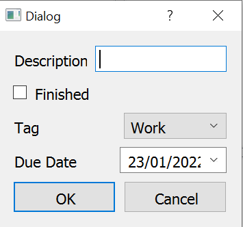
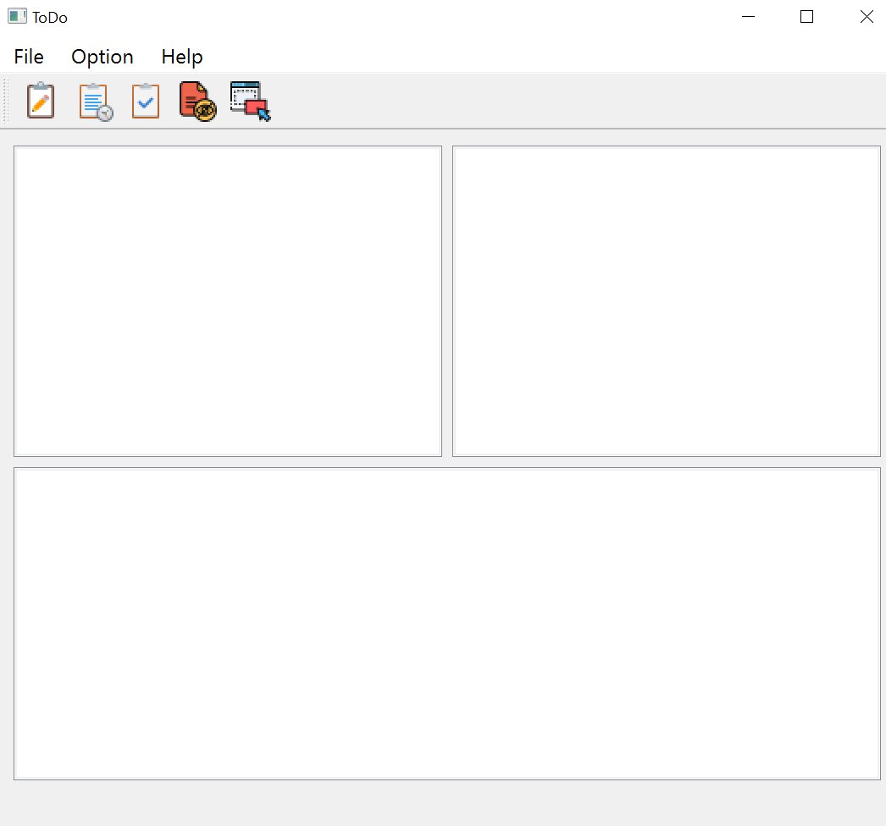
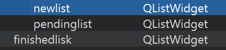
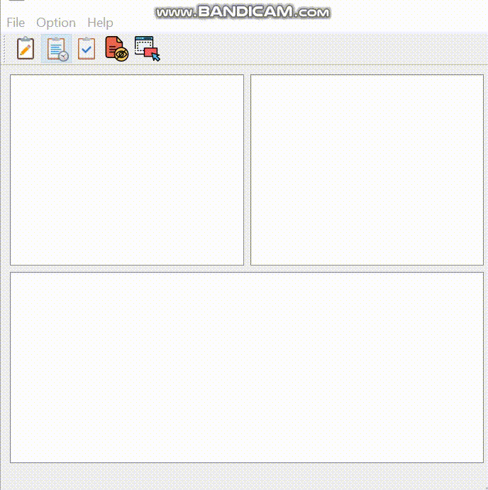
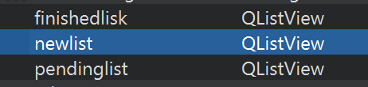

<br>
<br>
<p style="font-size:50px"  align="center" >Introduction</p>

<p style="font-size:20px" >Qt is a cross-platform GUI application framework that is used for developing application software that can be run on various software and hardware platforms with little or no changes in the underlying code.
<br>Qt contains a set of item view classes that use a model/view architecture to manage the relationship between data and the way it is presented to the user.Model–view–controller (MVC) is a software design pattern[1] commonly used for developing user interfaces that divide the related program logic into three interconnected elements. 
 </p>

  * <p style="font-size:15px" >Models : The central component of the pattern. It is the application's dynamic data structure, independent of the user interface.</p>
  * <p style="font-size:15px" > Views : Any representation of information such as a chart, diagram or table.</p>
 * <p style="font-size:15px" > Controller : Accepts input and converts it to commands for the model or view.</p>
<p style="font-size:20px;font-family:courier;">So how we can use this MVC ? Let code !!</p>


<br>
<p style="font-size:40px;font-family:verdana;"  align="center" >Todo App</p>

---
<br>

<p style="font-size:18px">The Goal from this App is to create the following interface that manage you tasks. It should have all the features of main application such as menues, actions and toolbar. The application must store an archive of all the pending and finished tasks. </p>


<br>
<p style="font-size:20px"  align="center" >Our project is devided into two parts:</p>


 * Item Based Model 
 * MVC Model 
<br>
<p style="font-size:30px"  align="center" >Item Based Model</p>
<p style="font-size:18px">All item models are based on the **QAbstractItemModel** class (provides an interface to data that is flexible enough to handle views that represent data in the form of tables, lists, and trees) This class defines an interface that is used by views and delegates to access data. The data itself does not have to be stored in the model.</p>

<p style="font-size:18px">Starting with the intefraces , we will create two interfaces: </P>

 * **newtask.ui** : handling to add new tasks and identified with their date , tag ,name and if it finished or not
   
  * * 

  <br>
  <br>

 * **todo.ui** : Handling the main interface that include all the components (listwidgets-menus-functionnalities... )
  <br>

 * * 

  <br>
  <br>
  <p style="font-size:18px">So as we say in this part we will use the listwidget </p> 

<br>


  
  <br>

  <p style="font-size:18px">As a second step we will create two classes:<br>* * * * * * * newtask
  <br>* * * * * * * todo </p> 
   
<p style="font-size:40px" align="center">newtask</p>   
  <p style="font-size:18px" align="center">This class admet the functionnalities of the new task interface , so it's include : </p>

# newtask.h
<p style="font-size:18px" align="center">The header of the class : </p>

  ```c++
  #ifndef NEWTASK_H
#define NEWTASK_H

#include <QDialog>

namespace Ui {
class NewTask;
}

class NewTask : public QDialog
{
    Q_OBJECT

public:
    explicit NewTask(QWidget *parent = nullptr);
    ~NewTask();
    void setDescription(QString desc);//set the description
    void setTag(QString tag);//set the tag 
    void setchekbox(bool ch);//check the box 
    QDate getDate();//get the date 
    bool isChecked(); //is checked or not
    void setdate(int y,int m, int d); //set the date 
    QString getTask();//get the task 


private:
    Ui::NewTask *ui;
};

#endif // NEWTASK_H

  ```
<br>

# newtask.cpp
<p style="font-size:18px; font-family:courier; " align="center">We set the minimum date that we will use </p>

```c++
 QDate date =QDate::currentDate();
    ui->dateEdit->setMinimumDate(date);
    ui->dateEdit->setDate(date);
```
<br>
<p style="font-size:18px ; font-family:courier; " align="center">We set the description </p>

```c++
void NewTask::setDescription(QString desc){
ui->lineEdit->setText(desc);
}
```
<br>
<p style="font-size:18px ; font-family:courier; " align="center">We set the Tag </p>

```c++
void NewTask::setTag(QString tag){
ui->comboBox->setCurrentText(tag);
}
```
<br>
<p style="font-size:18px ; font-family:courier; " align="center">We set if the button is chekcked </p>

```c++
bool NewTask::isChecked(){
if(ui->checkBox->isChecked()){
    return true;
}
return false;
}
void NewTask::setchekbox(bool ch){
ui->checkBox->setChecked(ch);
}

```
<br>
<p style="font-size:18px ; font-family:courier; " align="center">We set the date </p>

```c++
void NewTask::setdate(int y,int m, int d){
QDate da;

da.setDate(y,m,d);
ui->dateEdit->setDate(da);
}
```
<br>
<p style="font-size:18px ; font-family:courier; " align="center">We get the date and the task form string  </p>

```c++
QDate NewTask::getDate(){
return ui->dateEdit->date();
}
QString NewTask::getTask(){

QString a= ui->lineEdit->text() + " Due : " + ui->dateEdit->text() + "  Tag : " + ui->comboBox->currentText() +"";
return a;
}

```
<p style="font-size:18px" align="center">Then we will move to create our second class **todo**</p>
<br>
<p style="font-size:40px" align="center">todo</p>   
  <p style="font-size:18px" align="center">This class admet the functionnalities of the todo interface , so it's include : </p>

# todo.h
<p style="font-size:18px" align="center">The header of the class : </p>

```c++
#ifndef TODO_H
#define TODO_H

#include <QMainWindow>
#include <QFile>
#include <QCloseEvent>
#include <QDropEvent>


QT_BEGIN_NAMESPACE
namespace Ui { class ToDo; }
QT_END_NAMESPACE

class ToDo : public QMainWindow
{
    Q_OBJECT

public:
    ToDo(QWidget *parent = nullptr);
    ~ToDo();

private slots:
    void on_actionAdd_Task_triggered();//add task 

    void on_actionClose_triggered();//close and save 

void dropEvent(QDropEvent *event); //drop the task 
//slots responsible to  change the content of a task in the three lists 
    void slot1();

    void slot2();

    void slot3();

// pending task 
    void on_actionPending_Task_toggled(bool arg1);
//finishing task 
    void on_actionFinished_Task_toggled(bool arg1);
// hide task 
    void on_actionHide_Task_triggered();

protected:
//close the interface 
    void closeEvent(QCloseEvent* e) override;


private:
    Ui::ToDo *ui;
    QFile file;
};
#endif // TODO_H


```
<br>

# todo.cpp
<p style="font-size:18px ; font-family:courier; " align="center">we start with the implementation to open the task :</p>

```c++
 if (!file.open(QIODevice::ReadOnly | QIODevice::Text))
          return;
//where to add the items by cheking the first character 
    while (!file.atEnd()) {
        QString line = file.readLine();
        if(line.at(0)=="1"){
              ui->newlist->addItem(line.mid(1,line.size()));
        }else if(line.at(0)=="2"){
            ui->pendinglist->addItem(line.mid(1,line.size()));
        }else if(line.at(0)=="3"){
            ui->finishedlisk->addItem(line.mid(1,line.size()));
        }
    }
```
<br>
<p style="font-size:18px ; font-family:courier; " align="center">The implementation to add new task :</p>

```c++
void ToDo::on_actionAdd_Task_triggered()
{
    //calling the test dialog 
    NewTask dialog;
    auto reply= dialog.exec();
    if(reply == NewTask::Accepted)
    {
        //save the task on a text string
        QString text= dialog.getTask();
        //cheking in which list we add the ask based on the date 
        if(dialog.getDate()==QDate::currentDate() && !dialog.isChecked()){
            ui->newlist->addItem(text);
        }else if(dialog.getDate()!=QDate::currentDate() && !dialog.isChecked()){
            ui->pendinglist->addItem(text);
        }else if(dialog.isChecked()){
            ui->finishedlisk->addItem(text);
        }
    }
}
```
<br>
<p style="font-size:18px ; font-family:courier; " align="center">After we add the tasks and close the window we need to save the data that we alrealdy set , we named the file "myfile.txt":</p>

```c++
void ToDo::closeEvent(QCloseEvent *e){
    //save the content on this file 
    QFile file("C:/Users/Electro Fatal/Desktop/myfile.txt");
        if(file.open(QIODevice::ReadWrite | QIODevice::Text)){
            QTextStream out(&file);
            for(int i=0;i<ui->newlist->count();i++)
            {
                out << "1"<< ui->newlist->item(i)->text() << Qt::endl;
            }
            for(int i=0;i<ui->pendinglist->count();i++)
            {
                out << "2"<< ui->pendinglist->item(i)->text() << Qt::endl;
            }
            for(int i=0;i<ui->finishedlisk->count();i++)
            {
                out << "3"<< ui->finishedlisk->item(i)->text() << Qt::endl;
            }
            file.close();
        }
}
```
<br>
<p style="font-size:18px; font-family:courier; " align="center">To drop the task and drag it we add the implementaion bellow:</p>

```c++
void ToDo::dropEvent(QDropEvent *event){
    NewTask dialog;
    auto reply= dialog.exec();
}
ui->pendinglist->setDragDropMode(QAbstractItemView::DragDrop);
ui->newlist->setDragDropMode(QAbstractItemView::DragDrop);
ui->finishedlisk->setDragDropMode(QAbstractItemView::DragDrop);
ui->pendinglist->setDefaultDropAction(Qt::MoveAction);
ui->finishedlisk->setDefaultDropAction(Qt::MoveAction);
ui->newlist->setDefaultDropAction(Qt::MoveAction);
```
<br>
<p style="font-size:18px; font-family:courier; " align="center">To activate the pending toggled , we add :</p>

```c++
void ToDo::on_actionPending_Task_toggled(bool arg1)
{

    if(arg1){
        ui->pendinglist->setVisible(true);
    }else{
        ui->pendinglist->setVisible(false);
    }
}
ui->pendinglist->setVisible(true);
```
<br>
<p style="font-size:18px; font-family:courier; " align="center">To activate the finished toggled , we add :</p>

```c++
void ToDo::on_actionFinished_Task_toggled(bool arg1)
{
    if(arg1){
        ui->finishedlisk->setVisible(true);
    }else{
        ui->finishedlisk->setVisible(false);
    }
}
 ui->finishedlisk->setVisible(true);
```
<br>
<p style="font-size:18px; font-family:courier; " align="center">To activate hiding button, we add :</p>

```c++
void ToDo::on_actionHide_Task_triggered()
{
    ui->finishedlisk->setVisible(false);

}
```
<br>
<p style="font-size:18px; font-family:courier; " align="center">To change the content of a task , we add three slot that will be connected after with their lists , so with a double click on the task you will be able to change your task content : </p>

<p style="font-size:20px; font-family:courier; " align="center"> *slot1( )</p>

```c++
void ToDo:: slot1(){
    NewTask dialog;
    int i=1;
    QString task;
    //the new task 
    QListWidgetItem *a=ui->newlist->currentItem();
    //spliti the task 
    QStringList list = a->text().split(QRegularExpression("\\W+"), Qt::SkipEmptyParts);
    task+=list[0];
//store the description on a string 
    while(list[i]!="Due"){
         task+=" "+list[i];
         i++;
    }
//set the date 
    dialog.setdate(list[i+3].toInt(),list[i+1].toInt(),list[i+2].toInt());
    //set the description
    dialog.setDescription(task);
    //set the tag
    dialog.setTag(list[i+5]);
    auto reply= dialog.exec();


     if(reply == NewTask::Accepted)
     {
         QString text= dialog.getTask();
         if(dialog.getDate()==QDate::currentDate() && !dialog.isChecked()){
             ui->newlist->addItem(text);
         }else if(dialog.getDate()!=QDate::currentDate() && !dialog.isChecked()){
             ui->pendinglist->addItem(text);
         }else if(dialog.isChecked()){
             ui->finishedlisk->addItem(text);
         }
         //delete the item to not have a duplication
         delete a ;
     }
}
```

<p style="font-size:20px ; font-family:courier; " align="center"> *slot2( )</p>

```c++
void ToDo::slot2(){
    NewTask dialog;
    int i=1;
    QString task;
    QListWidgetItem *a=ui->pendinglist->currentItem();
    QStringList list = a->text().split(QRegularExpression("\\W+"), Qt::SkipEmptyParts);
    task+=list[0];
    while(list[i]!="Due"){
         task+=" "+list[i];
         i++;
    }
    dialog.setdate(list[i+3].toInt(),list[i+1].toInt(),list[i+2].toInt());
    dialog.setDescription(task);
    dialog.setTag(list[i+5]);
    auto reply= dialog.exec();
    if(reply == NewTask::Accepted){
         QString text= dialog.getTask();
         if(dialog.getDate()==QDate::currentDate() && !dialog.isChecked()){
             ui->newlist->addItem(text);
         }else if(dialog.getDate()!=QDate::currentDate() && !dialog.isChecked()){
             ui->pendinglist->addItem(text);
         }else if(dialog.isChecked()){
             ui->finishedlisk->addItem(text);
         }
         delete a ;
    }
}

```
<p style="font-size:20px ; font-family:courier; " align="center"> *slot3( )</p>

```c++
void ToDo::slot3(){
    NewTask dialog;
    int i=1;
    QString task;
    QListWidgetItem *a=ui->finishedlisk->currentItem();
    QStringList list = a->text().split(QRegularExpression("\\W+"), Qt::SkipEmptyParts);
    task+=list[0];
    while(list[i]!="Due"){
         task+=" "+list[i];
         i++;
    }
    dialog.setdate(list[i+3].toInt(),list[i+1].toInt(),list[i+2].toInt());
    dialog.setDescription(task);
    dialog.setchekbox(true);
    dialog.setTag(list[i+5]);
    auto reply= dialog.exec();
    if(reply == NewTask::Accepted){
         QString text= dialog.getTask();
         if(dialog.getDate()==QDate::currentDate() && !dialog.isChecked()){
             ui->newlist->addItem(text);
         }else if(dialog.getDate()!=QDate::currentDate()  && !dialog.isChecked()){
             ui->pendinglist->addItem(text);
         }else if(dialog.isChecked()){
             ui->finishedlisk->addItem(text);
         }
         delete a ;
     }
}
```
<p style="font-size:18px; font-family:courier; " align="center">Then we connected to their lists : </p>

```c++
connect(ui->newlist, SIGNAL(itemDoubleClicked(QListWidgetItem*)), this,SLOT(slot1()));
connect(ui->pendinglist, SIGNAL(itemDoubleClicked(QListWidgetItem*)), this,SLOT(slot2()));
connect(ui->finishedlisk, SIGNAL(itemDoubleClicked(QListWidgetItem*)), this,SLOT(slot3()));
```
# **main class**

```c++
#include "todo.h"

#include <QApplication>

int main(int argc, char *argv[])
{
    QApplication a(argc, argv);
    ToDo w;
    w.show();
    return a.exec();
}

```

<p style="font-size:35px"  align="center" >Test</p>


<br>
<p style="font-size:30px"  align="center" >MVC Model</p>
<p style="font-size:18px" align="center">MVC consists of three kinds of objects. The Model is the application object, the View is its screen presentation, and the Controller defines the way the user interface reacts to user input</p>

<br>
<p style="font-size:18px" align="center">We will create the same interfaces with the same composants exept that we will change the listwidgets with listsview</p>


<br> 
<p style="font-size:18px" align="center">Also we will use the same newtask class but change the todo class</p>

<br>
<p style="font-size:40px" align="center">todo</p>   
  <p style="font-size:18px" align="center">This class admet the functionnalities of the todo interface , so it's include : </p>

# todo.h
<p style="font-size:18px" align="center">The header of the class : </p>

```c++
#ifndef TODO_H
#define TODO_H

#include <QMainWindow>
#include <QFile>
#include <QCloseEvent>
#include <QDropEvent>
#include <QDropEvent>
#include<QStringListModel>

QT_BEGIN_NAMESPACE
namespace Ui { class ToDo; }
QT_END_NAMESPACE

class ToDo : public QMainWindow
{
    Q_OBJECT

public:
    ToDo(QWidget *parent = nullptr);
    ~ToDo();

private slots:
    void on_actionAdd_Task_triggered();

    void on_actionClose_triggered();

void dropEvent(QDropEvent *event);
void drop();

    void slot1();

    void slot2();

    void slot3();

    void on_actionPending_Task_toggled(bool arg1);

    void on_actionFinished_Task_toggled(bool arg1);

    void on_actionHide_Task_triggered();

public :
    QStringListModel *model1;
    QStringListModel *model2;
    QStringListModel *model3;

    QStringList newtasks;
    QStringList Finishedtasks;
    QStringList Pendingtasks;

protected:
    //if we close the application =>our tasks are saved
    void closeEvent(QCloseEvent* e) override;


private:
    Ui::ToDo *ui;
    QFile file;
};
#endif // TODO_H
```
# todo.cpp
<p style="font-size:18px; font-family:courier; " align="center">now we need to create models we are going to use QStringModel
</p>

```c++
model1 = new QStringListModel();
model2 = new QStringListModel();
model3 = new QStringListModel();

model1->setStringList(newtasks);
ui->newlist->setModel(model1);

model2->setStringList(Pendingtasks);
ui->pendinglist->setModel(model2);
model3->setStringList(Finishedtasks);
ui->finishedlisk->setModel(model3);
```
<br>
<p style="font-size:18px; font-family:courier; " align="center">To add a ask we implement :
</p>

```c++
void ToDo::on_actionAdd_Task_triggered()
{
    NewTask dialog;
    auto reply= dialog.exec();
    if(reply == NewTask::Accepted)
    {
        QString text= dialog.getTask();
        if(dialog.getDate()==QDate::currentDate() && !dialog.isChecked()){
            newtasks.append(text);
        }else if(dialog.getDate()!=QDate::currentDate() && !dialog.isChecked()){
            Pendingtasks.append(text);
        }else if(dialog.isChecked()){
            Finishedtasks.append(text);
        }
    }

    model1->setStringList(newtasks);
    ui->newlist->setModel(model1);

    model2->setStringList(Pendingtasks);
    ui->pendinglist->setModel(model2);


    model3->setStringList(Finishedtasks);
    ui->finishedlisk->setModel(model3);
}
```
<br>
<p style="font-size:18px; font-family:courier; " align="center">To save in "myfile.txt" after closing window we add :
</p>

```c++
void ToDo::closeEvent(QCloseEvent *e){
    QFile file("C:/Users/Electro Fatal/Desktop/myfile.txt");
    if(file.open(QIODevice::ReadWrite | QIODevice::Text)){
        QTextStream out(&file);
        for(int i=0;i<newtasks.size();i++)
        {
            out << "1"<< newtasks.at(i)<< Qt::endl;
        }
        for(int i=0;i<Pendingtasks.size();i++)
        {
            out << "2"<< Pendingtasks.at(i) << Qt::endl;
        }
        for(int i=0;i<Finishedtasks.size();i++)
        {
            out << "3"<< Finishedtasks.at(i) << Qt::endl;
        }
        file.close();
    }
}
```
<br>
<p style="font-size:18px ; font-family:courier; " align="center">To Drag and drop we set the modes 
</p>

```c++
 ui->pendinglist->setDragDropMode(QAbstractItemView::DragDrop);
    ui->newlist->setDragDropMode(QAbstractItemView::DragDrop);
    ui->finishedlisk->setDragDropMode(QAbstractItemView::DropOnly);

    ui->pendinglist->setDragDropMode(QAbstractItemView::DragDrop);
         ui->newlist->setDragDropMode(QAbstractItemView::DragDrop);
         ui->finishedlisk->setDragDropMode(QAbstractItemView::DropOnly);
```
<p style="font-size:18px; font-family:courier; " align="center">And then we make the slot responsible for drag and drop:</p>

```c++
void ToDo::drop(){

    NewTask dialog;
    int i=1;
    QString task;
    QModelIndex index=ui->newlist->currentIndex();
    QString a=newtasks.at(index.row());
    QStringList list = a.split(QRegularExpression("\\W+"), Qt::SkipEmptyParts);
    task+=list[0];
    while(list[i]!="Due"){
         task+=" "+list[i];
         i++;
    }
    dialog.setdate(list[i+3].toInt(),list[i+1].toInt(),list[i+2].toInt()+1);
    dialog.setDescription(task);
    dialog.setTag(list[i+5]);
    auto reply= dialog.exec();
    if(reply == NewTask::Accepted){
         QString text= dialog.getTask();
         if(dialog.getDate()==QDate::currentDate() && !dialog.isChecked()){

         }else if(dialog.getDate()!=QDate::currentDate() && !dialog.isChecked()){
             Pendingtasks.append(text);
             newtasks.removeAt(index.row());
         }else if(dialog.isChecked()){
             Finishedtasks.append(text);
             newtasks.removeAt(index.row());
         }
    }

    ui->pendinglist->clearSelection();
    model1->setStringList(newtasks);
    ui->newlist->setModel(model1);

    model2->setStringList(Pendingtasks);
    ui->pendinglist->setModel(model2);


    model3->setStringList(Finishedtasks);
    ui->finishedlisk->setModel(model3);
}

```
<p style="font-size:18px; font-family:courier; " align="center">Connected with the model </p>

```c++
 connect(model2, SIGNAL(rowsInserted(QModelIndex,int,int)), this,SLOT(drop()));
```
<p style="font-size:18px; font-family:courier; " align="center">To change the content of our tasks we need to add three slots that will be associeted to the lists , so with a double click on your tasks you are able to change them :</p>
<p style="font-size:20px ; font-family:courier; " align="center"> *slot1( )</p>

```c++
void ToDo:: slot1(){
    NewTask dialog;
    int i=1;
    QString task;
    QModelIndex index=ui->newlist->currentIndex();
    QString a=newtasks.at(index.row());
    QStringList list = a.split(QRegularExpression("\\W+"), Qt::SkipEmptyParts);
    task+=list[0];

    while(list[i]!="Due"){
         task+=" "+list[i];
         i++;
    }

    dialog.setdate(list[i+3].toInt(),list[i+1].toInt(),list[i+2].toInt());
    dialog.setDescription(task);
    dialog.setTag(list[i+5]);
    auto reply= dialog.exec();


     if(reply == NewTask::Accepted)
     {
         QString text= dialog.getTask();
         if(dialog.getDate()==QDate::currentDate() && !dialog.isChecked()){
             newtasks.append(text);
             newtasks.removeAt(index.row());

         }else if(dialog.getDate()!=QDate::currentDate() && !dialog.isChecked()){
             Pendingtasks.append(text);
             newtasks.removeAt(index.row());
         }else if(dialog.isChecked()){
             Finishedtasks.append(text);
             newtasks.removeAt(index.row());
         }

     }

     model1->setStringList(newtasks);
     ui->newlist->setModel(model1);

     model2->setStringList(Pendingtasks);
     ui->pendinglist->setModel(model2);


     model3->setStringList(Finishedtasks);
     ui->finishedlisk->setModel(model3);

}
```
<p style="font-size:20px ; font-family:courier; " align="center"> *slot2( )</p>

```c++
void ToDo::slot2(){
    NewTask dialog;
    int i=1;
    QString task;
    QModelIndex index=ui->newlist->currentIndex();
    QString a=newtasks.at(index.row());
    QStringList list = a.split(QRegularExpression("\\W+"), Qt::SkipEmptyParts);
    task+=list[0];

    while(list[i]!="Due"){
         task+=" "+list[i];
         i++;
    }

    dialog.setdate(list[i+3].toInt(),list[i+1].toInt(),list[i+2].toInt());
    dialog.setDescription(task);
    dialog.setTag(list[i+5]);
    auto reply= dialog.exec();


     if(reply == NewTask::Accepted)
     {
         QString text= dialog.getTask();
         if(dialog.getDate()==QDate::currentDate() && !dialog.isChecked()){
             newtasks.append(text);
             newtasks.removeAt(index.row());

         }else if(dialog.getDate()!=QDate::currentDate() && !dialog.isChecked()){
             Pendingtasks.append(text);
             newtasks.removeAt(index.row());
         }else if(dialog.isChecked()){
             Finishedtasks.append(text);
             newtasks.removeAt(index.row());
         }

     }

     model1->setStringList(newtasks);
     ui->newlist->setModel(model1);

     model2->setStringList(Pendingtasks);
     ui->pendinglist->setModel(model2);


     model3->setStringList(Finishedtasks);
     ui->finishedlisk->setModel(model3);
}
```
<p style="font-size:20px ; font-family:courier; " align="center"> *slot3( )</p>

```c++
void ToDo::slot3(){
    NewTask dialog;
    int i=1;
    QString task;
    QModelIndex index=ui->finishedlisk->currentIndex();
    QString a=Finishedtasks.at(index.row());
    QStringList list = a.split(QRegularExpression("\\W+"), Qt::SkipEmptyParts);
    task+=list[0];
    while(list[i]!="Due"){
         task+=" "+list[i];
         i++;
    }
    dialog.setdate(list[i+3].toInt(),list[i+1].toInt(),list[i+2].toInt());
    dialog.setDescription(task);
    dialog.setchekbox(true);
    dialog.setTag(list[i+5]);
    auto reply= dialog.exec();
    if(reply == NewTask::Accepted){
         QString text= dialog.getTask();
         if(dialog.getDate()==QDate::currentDate() && !dialog.isChecked()){
             newtasks.append(text);
              Finishedtasks.removeAt(index.row());
         }else if(dialog.getDate()!=QDate::currentDate() && !dialog.isChecked()){
             Pendingtasks.append(text);
              Finishedtasks.removeAt(index.row());
         }else if(dialog.isChecked()){

         }

     }

            model1->setStringList(newtasks);
    ui->newlist->setModel(model1);

    model2->setStringList(Pendingtasks);
    ui->pendinglist->setModel(model2);


    model3->setStringList(Finishedtasks);
    ui->finishedlisk->setModel(model3);
}
```
<p style="font-size:18px; font-family:courier; " align="center">Then we connected the slots to the lists :</P>

```c++
connect(ui->newlist, SIGNAL(doubleClicked(QModelIndex)), this,SLOT(slot1()));
connect(ui->pendinglist, SIGNAL(doubleClicked(QModelIndex)), this,SLOT(slot2()));
connect(ui->finishedlisk, SIGNAL(doubleClicked(QModelIndex)), this,SLOT(slot3()));
```
<br>
<p style="font-size:18px; font-family:courier; " align="center">To close the interface we connect the button to the slot6( ) :
</p>

```c++
void ToDo::slot6(){
    this->close();
}
connect(ui->actionClose,&QAction::triggered,this,SLOT(slot6()));
```
<p style="font-size:35px"  align="center" >Test</p>


<p style="font-size:45px"  align="center" >Conclusion</p>

<p style="font-size:20px" >The Qt Framework handles the MVC pattern implicitly, especially when we work with pre-built APIs of the model, view, and delegation classes.Combined with the trend of front-end design in recent years, the final choice is QT + Vue + element UI + SQLite (the database is selected according to the needs)
</p>

* QT is responsible for interface and hardware processing
* SQLite for data storage
* Vue + element UI implements the front end
  
